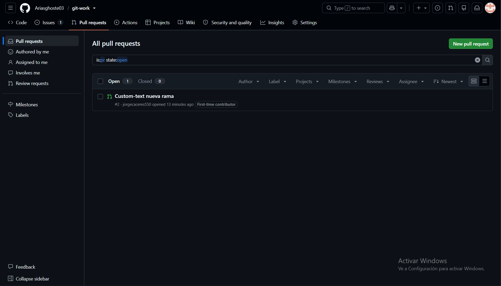
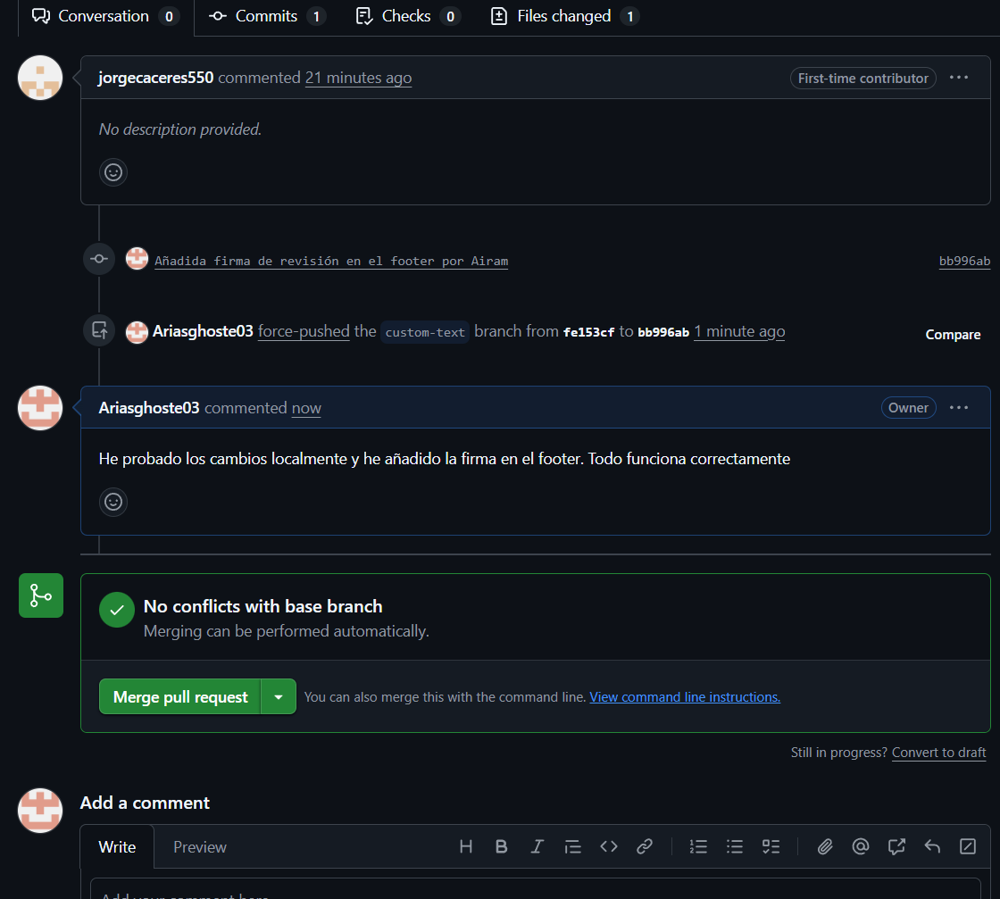
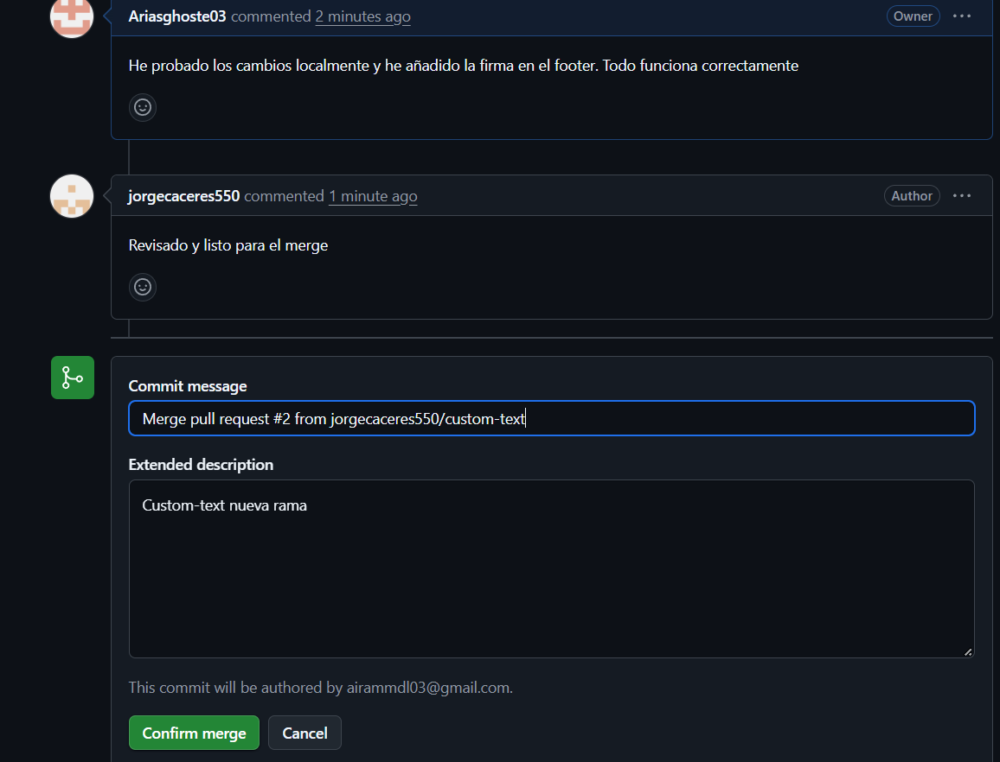
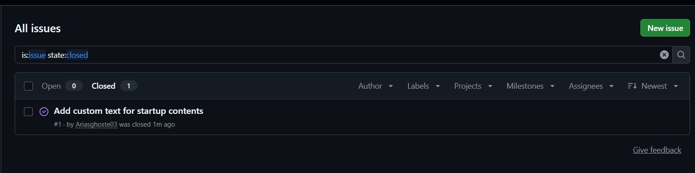
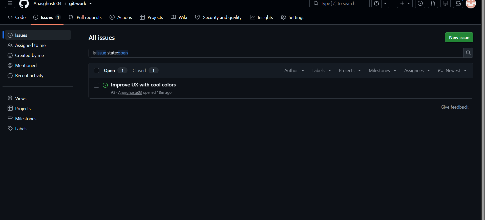
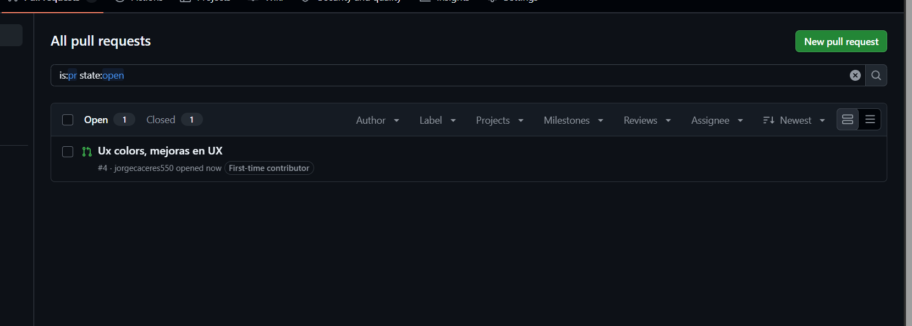
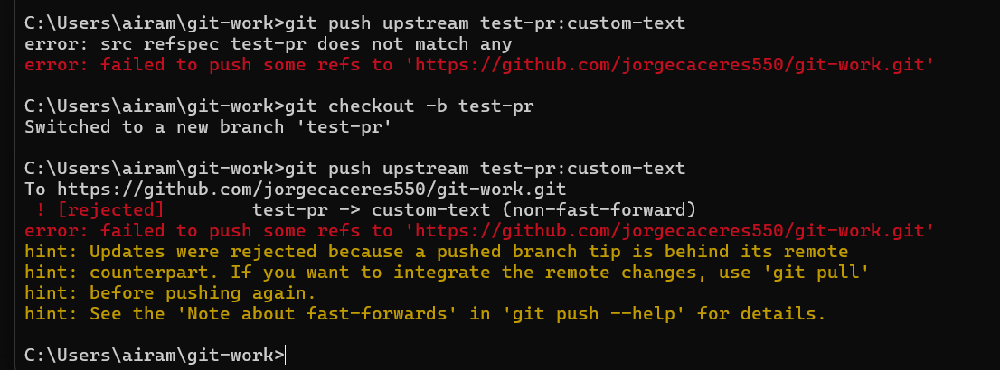
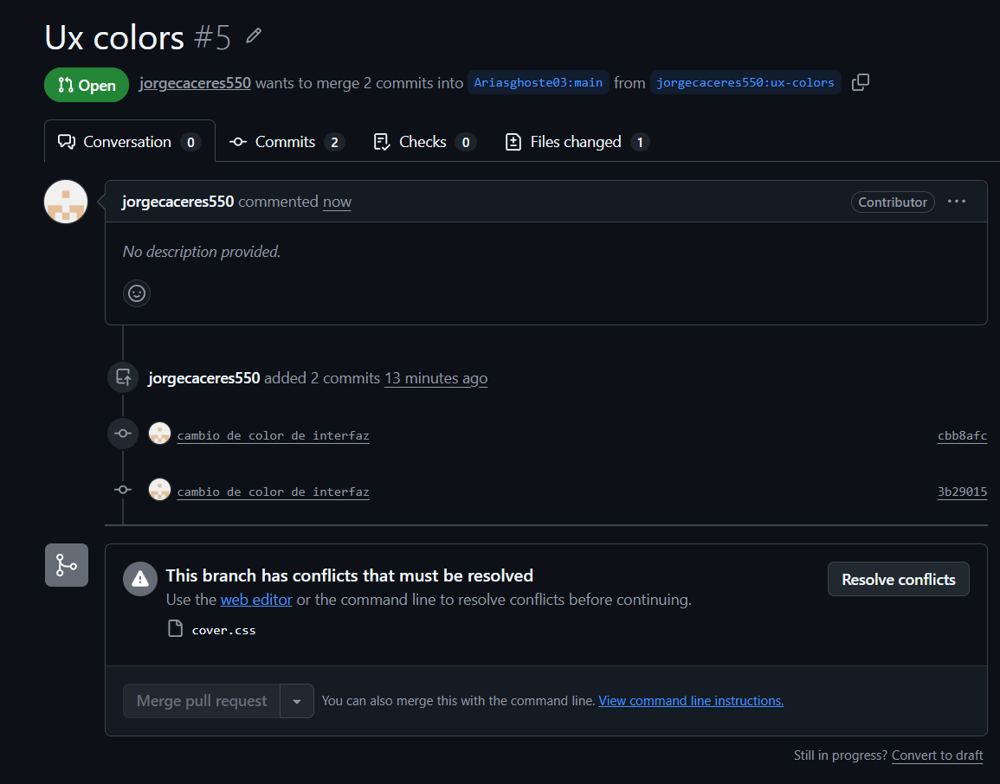
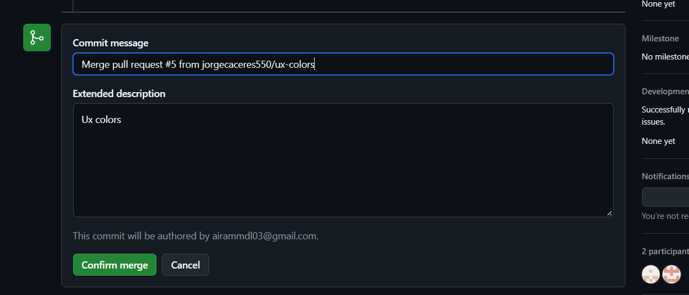

# PRÁCTICA: FLUJO DE TRABAJO EN GIT Y GESTIÓN DE CONFLICTOS CON FORK

***Nombre:*** Airam (User 1) y Jorge (User 2)  
***Curso:*** 2º de Ciclo Superior de Desarrollo de Aplicaciones Web.

### ÍNDICE

+ [Introducción](#id1)
+ [Objetivos](#id2)
+ [Material empleado](#id3)
+ [Desarrollo](#id4)
+ [Conclusiones](#id5)

#### ***Introducción***. 

Git es el sistema de control de versiones distribuido más utilizado en el desarrollo de software. Cuando dos desarrolladores trabajan sobre una misma línea de código o archivo CSS, surgen conflictos. Esta práctica abarca la simulación completa de un flujo de trabajo basado en forks, uso de Pull Requests, comunicación mediante Issues y la resolución manual de conflictos, finalizando con la publicación de una versión estable.

#### ***Objetivos***. 

1. Configurar un repositorio en GitHub.
2. Implementar un flujo de trabajo colaborativo mediante la creación de un fork y sincronización.
3. Gestionar tareas del proyecto mediante Issues y vinculación automática con Pull Requests.
4. Simular, identificar y resolver un conflicto de fusión en Git priorizando la versión requerida.
5. Aplicar versión creando una etiqueta y publicando en GitHub.

#### ***Material empleado***. 

* **Hardware:** Dos ordenadores personales con conexión a Internet.
* **Software:**
  * Git.
  * Editor de texto.
  * Navegador Web.
  * Plataforma GitHub.

#### ***Desarrollo***. 

##### Paso 1: Creación del repositorio y estructura inicial (User 1)
User 1 creó el repositorio público denominado git-work en GitHub con README.md y licencia MIT. A continuación, clonó el proyecto localmente y añadió los archivos base index.html, bootstrap.min.css y cover.css, subiendo los cambios a la rama principal.

##### Paso 2: Fork y primer flujo colaborativo (User 2)
User 2 realizó un fork del repositorio Ariasghoste03/git-work hacia su cuenta de GitHub (jorgecaceres550/git-work) y lo clonó en su máquina. User 1 creó la Issue #1 con el título "Add custom text for startup contents". User 2 creó una rama local llamada custom-text, modificó el archivo index.html para personalizar el contenido y envió un Pull Request a User 1.

##### Paso 3: Revisión, conversación y cierre de la Issue #1
User 1 configuró el remoto upstream apuntando al repo original para probar los cambios. Durante la revisión del PR, ambos usuarios entablaron una discusión en la pestaña del PR añadiendo cambios adicionales. Tras aprobar las modificaciones, User 1 fusionó el PR referenciando y cerrando la Issue #1. Posteriormente, User 2 actualizó su rama principal sincronizando con upstream.

##### Paso 4: Generación controlada del conflicto de fusión (Issue #3)
User 1 creó la Issue #3: "Improve UX with cool colors".
1. User 1: Editó la línea del color de fondo en cover.css estableciendo color: purple;. Realizó un commit local en su rama main sin hacer push.
2. User 2: Creó la rama ux-colors, modificó la misma línea del archivo cover.css fijando background-color: darkgreen; y envió el PR #5 hacia el repositorio principal.

##### Paso 5: Dificultades encontradas y resolución del conflicto
Al abrir el PR #5, GitHub detectó que la misma línea de cover.css había sido modificada en ambas ramas, bloqueando la fusión.

- Dificultad encontrada: Durante el envío del PR, User 2 experimentó un error Everything up-to-date al intentar subir la rama, originado por falta de ejecución del git commit tras editar en nano. Se solucionó ejecutando git add cover.css seguido de git commit y git push -u origin ux-colors.

- Resolución del conflicto: User 1 accedió al editor de conflictos de GitHub. Siguiendo el criterio del enunciado, se descartó la línea conflictiva de User 1 (purple) y se mantuvo el cambio propuesto por User 2 (red). Se completó el commit merge y se aprobó el Pull Request #5.

##### Paso 6: Cambio final, cierre de Issue #3 y Release 0.1.0
User 1 sincronizó su copia local mediante git pull origin main. A continuación:
1. Modificó la propiedad text-shadow en la línea 20 de cover.css aplicando: text-shadow: 2px 2px 8px lightgreen;.
2. Realizó un commit cerrando explícitamente la Issue #3: git commit -m "Add text-shadow to cover.css and closes #3".
3. Subió los cambios con git push origin main.
4. Creó la etiqueta de versión local: git tag -a 0.1.0 -m "Release 0.1.0".
5. Envió la etiqueta a GitHub con git push origin 0.1.0 y procedió a publicar oficialmente la Release 0.1.0 desde la interfaz web de GitHub.

#### Conclusiones. 

El desarrollo de esta práctica nos ha permitido comprender de manera práctica el ciclo de vida de un desarrollo colaborativo mediante Git y GitHub. Hemos experimentado cómo la utilización adecuada de ramas, forks y revisiones mediante Pull Requests permite mantener un código limpio y controlado. Asimismo, la resolución directa del conflicto nos ha enseñado a interpretar las marcas de Git y a aplicar buenas prácticas de integración continua, vincular commits con Issues para trazabilidad y realizar entregas formales mediante Releases.